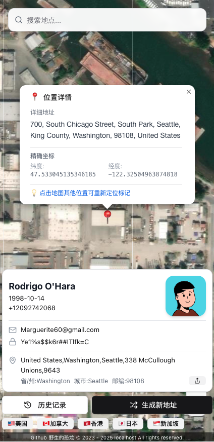

# 一个野生的地址生成器

<p align="left">
  
  
  
  
  
  
  
  
  
  
  
  
</p>

中文 | [English](https://github.com/YeShengDe/AddressGeneratorFe/blob/main/docs/README_en.md)

## ✨ 功能特性

- 🗺️ **基于 Google 地图，真实地理数据**：生成的地址均为实际存在的真实地点
- 🌍 **支持全球地址**：地理覆盖完整，数据权威
- 👤 **全套个人信息生成**：姓名、性别、电话、邮箱、密码、完整地址一应俱全
- 🕰️ **历史记录**：自动保存最近 10 条生成记录，支持一键还原
- 🚫 **无广告体验**：界面简洁，无任何广告干扰
- 📱 **移动端适配**：响应式设计，手机/平板/PC 均可流畅使用

---

## 🚀 部署方法（推荐 Cloudflare Pages）

### Cloudflare Pages 一键部署

[](https://deploy.workers.cloudflare.com/?url=https://github.com/YeShengDe/AddressGeneratorFe)

1.  **Fork 本仓库**
    点击此页面右上角的 **Fork** 按钮，将这个仓库复制到您自己的 GitHub 账户下。

2.  **通过上方按钮连接到 Cloudflare**
    点击上方的 "Deploy with Cloudflare Pages" 按钮，您将被引导至 Cloudflare Pages 的创建页面。

3.  **连接您 Fork 的仓库**
    在 Cloudflare 页面中，授权并选择您刚刚 Fork 的 `AddressGeneratorFe` 仓库。

4.  **配置构建设置**
    在 "构建和部署" 设置页面，Cloudflare 应该会自动检测到 Next.js 并填入正确的设置。请**务必确认**所有设置如下，并**添加环境变量**：
    - **框架预设 / Framework preset**: `Next.js (Static HTML Export)`
    - **构建命令 / Build command**: `pnpm run build`
    - **构建输出目录 / Build output directory**: `dist`

    #### **环境变量 (不是必须 不设置可以流畅运行) / Environment variables **

    向下滚动到环境变量部分，点击 **添加变量 (Add variable)**，然后设置：
    - **变量名称 / Variable name**: `NEXT_PUBLIC_ANALYTICS_ID`
    - **值 / Value**: `G-XXXXXXXXXX` _(在这里输入您自己的 Google Analytics G-ID)_

5.  **保存并部署**
    点击 **保存并部署 (Save and Deploy)**。Cloudflare 将会自动开始构建和部署您的项目，几分钟后即可访问。

### Vercel 部署

[](https://vercel.com/new/clone?repository-url=https://github.com/YeShengDe/AddressGeneratorFe)

---

## 🖼️ 截图

<div align="center" style="margin-bottom: 1.5em;">
  
  <div style="margin: 0.5em 0 1.5em 0; color: #888; font-size: 15px;">（1）PC 页面</div>
</div>
<div align="center" style="margin-bottom: 1.5em;">
  
  <div style="margin: 0.5em 0 1.5em 0; color: #888; font-size: 15px;">（2）移动端页面</div>
</div>
<div align="center" style="margin-bottom: 1.5em;">
  
  <div style="margin: 0.5em 0 1.5em 0; color: #888; font-size: 15px;">（3）分享页面</div>
</div>

---

## 🛠️ 本地开发

### 环境要求

- Node.js 18.0 或更高
- pnpm（推荐）或 npm/yarn

### 安装依赖

```bash
pnpm install
# 或
npm install
# yarn install
```

### 启动开发服务器

```bash
pnpm dev
# 或
npm run dev
# yarn dev
```

打开 [http://localhost:3000](http://localhost:3000) 查看应用。

### 构建生产版本

```bash
pnpm build
```

---

## 🎯 使用说明

1. **生成地址**: 点击"生成新地址"按钮获取随机地址信息
2. **选择地区**: 从下拉菜单中选择美国州或加拿大省份
3. **复制信息**: 点击任意数据项即可复制到剪贴板
4. **查看地图**: 在地图面板中查看地址的实际位置
5. **历史记录**: 从历史面板中快速恢复之前生成的数据

---

## 🤝 贡献

欢迎提交 Issue 和 Pull Request！

## 📄 许可证

[MIT License](LICENSE)

## 🙏 致谢

- [OpenStreetMap](https://www.openstreetmap.org/) - 地理数据API
- [FakerAPI](https://fakerapi.it/) - 用户数据生成
- [shadcn/ui](https://ui.shadcn.com/) - UI组件库
- [Lucide](https://lucide.dev/) - 图标库

---

**注意**: 生成的地址信息仅供测试和开发使用，请勿用于实际业务或非法用途。
