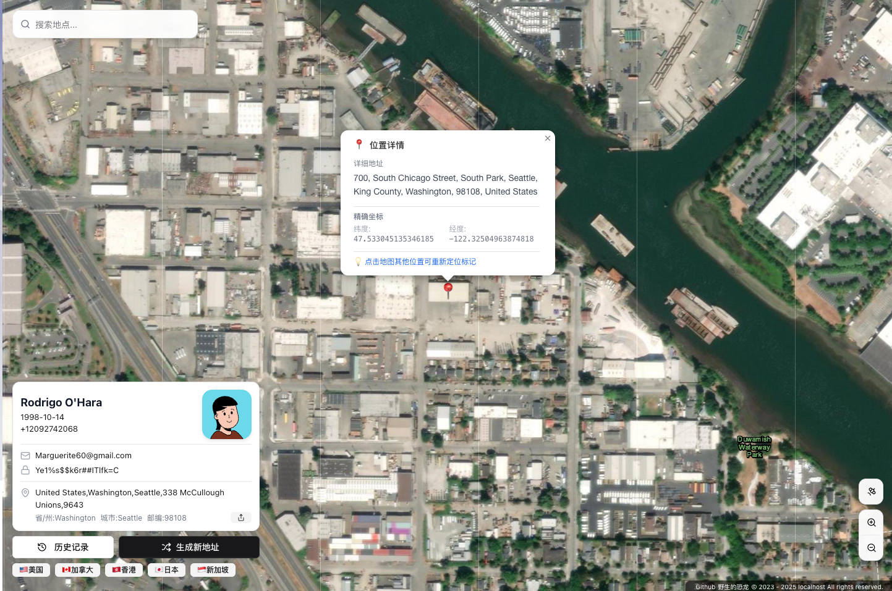
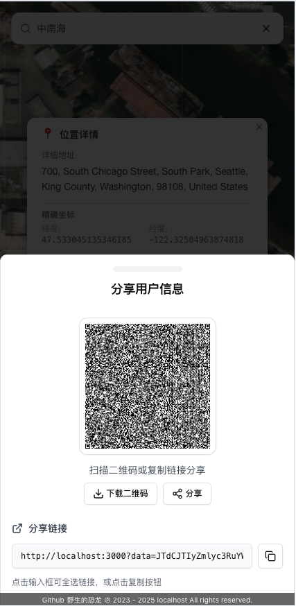

# A Wild Address Generator

<p align="left">
  
  
  
  
  
  
  
  
  
  
  
  
</p>

[中文](https://github.com/YeShengDe/AddressGeneratorFe/blob/main/README.md) | English

## 🚀 Deployment (Recommended: Cloudflare Pages)

### One-click Deploy to Cloudflare Pages

[](https://deploy.workers.cloudflare.com/?url=https://github.com/YeShengDe/AddressGeneratorFe)

1. **Fork this repository**
   Click the **Fork** button at the top right of this page to copy the repo to your own GitHub account.

2. **Connect to Cloudflare via the button above**
   Click the "Deploy with Cloudflare Pages" button above, and you'll be guided to the Cloudflare Pages creation page.

3. **Connect your forked repo**
   On the Cloudflare page, authorize and select your forked `AddressGeneratorFe` repo.

4. **Configure build settings**
   On the "Build and Deploy" settings page, Cloudflare should auto-detect Next.js and fill in the correct settings. **Make sure** all settings are as follows, and **add environment variables** if needed:
   - **Framework preset**: `Next.js (Static HTML Export)`
   - **Build command**: `pnpm run build`
   - **Build output directory**: `dist`

   #### **Environment variables (optional)**

   Scroll down to the environment variables section, click **Add variable**, then set:
   - **Variable name**: `NEXT_PUBLIC_ANALYTICS_ID`
   - **Value**: `G-XXXXXXXXXX` _(your own Google Analytics G-ID)_

5. **Save and Deploy**
   Click **Save and Deploy**. Cloudflare will automatically build and deploy your project. After a few minutes, your site will be live.

### Deploy to Vercel

[](https://vercel.com/new/clone?repository-url=https://github.com/YeShengDe/AddressGeneratorFe)

---

## 🖼️ Screenshots

<div align="center" style="margin-bottom: 1.5em;">
  
  <div style="margin: 0.5em 0 1.5em 0; color: #888; font-size: 15px;">(1) Desktop UI</div>
</div>
<div align="center" style="margin-bottom: 1.5em;">
  
  <div style="margin: 0.5em 0 1.5em 0; color: #888; font-size: 15px;">(2) Mobile UI</div>
</div>
<div align="center" style="margin-bottom: 1.5em;">
  
  <div style="margin: 0.5em 0 1.5em 0; color: #888; font-size: 15px;">(3) Share Page</div>
</div>

---

## 🛠️ Local Development

### Requirements

- Node.js 18.0 or above
- pnpm (recommended), npm, or yarn

### Install dependencies

```bash
pnpm install
# or
npm install
# yarn install
```

### Start development server

```bash
pnpm dev
# or
npm run dev
# yarn dev
```

Open [http://localhost:3000](http://localhost:3000) to view the app.

### Build for production

```bash
pnpm build
```

---

## 🎯 Usage

1. **Generate address**: Click the "Generate New Address" button to get a random address
2. **Select region**: Choose a US state or Canadian province from the dropdown
3. **Copy info**: Click any data item to copy it to the clipboard
4. **View map**: See the actual location on the map panel
5. **History**: Quickly restore previously generated data from the history panel

---

## 🤝 Contributing

Feel free to submit Issues and Pull Requests!

## 📄 License

[MIT License](LICENSE)

## 🙏 Acknowledgements

- [OpenStreetMap](https://www.openstreetmap.org/) - Geographic data API
- [FakerAPI](https://fakerapi.it/) - User data generation
- [shadcn/ui](https://ui.shadcn.com/) - UI component library
- [Lucide](https://lucide.dev/) - Icon library

---

**Note**: The generated address information is for testing and development purposes only. Do not use it for real business or illegal activities.
